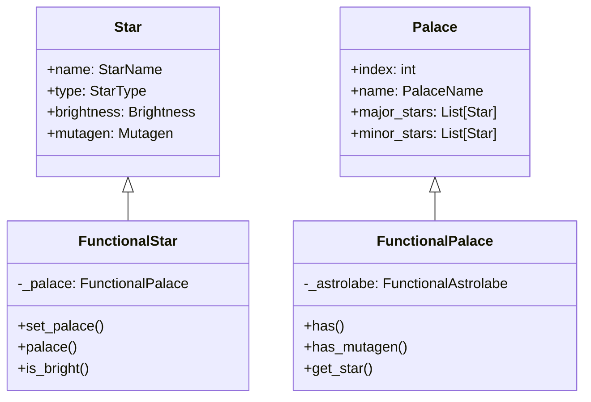

# Design Document: Code Quality Improvements

## Overview

This design document outlines the technical approach for improving the code quality of the iztro-py library. The improvements focus on four main areas:

1. **Type System Fixes** - Resolving 38 mypy type errors related to inheritance and type annotations
2. **Codebase Cleanup** - Organizing debug scripts and cleaning the root directory
3. **Linting Fixes** - Resolving ruff warnings for consistent code style
4. **Test Coverage** - Improving coverage for low-coverage modules
5. **Documentation** - Adding missing documentation files

## Architecture

The current architecture uses a class hierarchy where `FunctionalPalace`, `FunctionalStar`, and `FunctionalSurpalaces` extend their base classes (`Palace`, `Star`, `SurroundedPalaces`). The type errors arise from:

1. **Covariance issues** - Lists of subclass instances being assigned to parent class type annotations
2. **Missing type annotations** - Methods returning subclass instances but annotated with parent types
3. **Attribute access** - Parent class types not recognizing subclass-specific methods



## Components and Interfaces

### 1. Type System Fix Strategy

The primary fix involves using `Sequence` instead of `List` for covariant type annotations and ensuring proper type casting:

**Option A: Use Sequence (Recommended)**
```python
from typing import Sequence

class Palace(BaseModel):
    major_stars: Sequence[Star] = Field(default_factory=list)
```

**Option B: Use Generic Types**
```python
from typing import TypeVar, Generic

T = TypeVar('T', bound='Star')

class Palace(BaseModel, Generic[T]):
    major_stars: List[T] = Field(default_factory=list)
```

**Selected Approach**: Option A with `Sequence` is simpler and sufficient for read-only access patterns.

### 2. File Organization

```
iztro-py/
├── src/                    # Source code
├── tests/                  # Test files
├── docs/                   # Documentation
├── examples/               # Usage examples
├── scripts/                # Debug and verification scripts (NEW)
│   ├── check_hour.py
│   ├── check_parents_palace.py
│   ├── verify_astrolabe.py
│   └── ...
├── README.md
├── README_EN.md
├── README_KO.md            # NEW
├── CONTRIBUTING.md         # NEW
├── pyproject.toml
└── ...
```

### 3. Type Annotation Fixes

Key files requiring fixes:

| File | Issue | Fix |
|------|-------|-----|
| `data/types.py` | `List[Star]` not covariant | Change to `Sequence[Star]` |
| `functional_astrolabe.py` | Return type mismatch | Add proper type casting |
| `functional_palace.py` | Star list type mismatch | Use `Sequence` |
| `functional_surpalaces.py` | Palace type mismatch | Update type annotations |

## Data Models

No changes to data models are required. The fixes are purely at the type annotation level.

## Correctness Properties

*A property is a characteristic or behavior that should hold true across all valid executions of a system-essentially, a formal statement about what the system should do. Properties serve as the bridge between human-readable specifications and machine-verifiable correctness guarantees.*

Based on the prework analysis, most acceptance criteria are testable as examples (specific test cases) rather than properties. However, one property can be identified:

### Property 1: Test Coverage Threshold
*For any* test run with coverage enabled, the overall coverage percentage SHALL be at least 85%.
**Validates: Requirements 4.1**

Note: Most other acceptance criteria (1.1-1.4, 2.1-2.3, 3.1-3.3, 4.2-4.5, 5.1-5.3) are testable as specific examples since they verify specific tool outputs or file existence rather than universal properties across inputs.

## Error Handling

No changes to error handling are required for this improvement effort.

## Testing Strategy

### Unit Testing

Unit tests will verify:
1. Type checker passes without errors (mypy exit code 0)
2. Linter passes without errors (ruff exit code 0)
3. Coverage thresholds are met
4. Documentation files exist

### Property-Based Testing

Property-based testing library: **hypothesis** (already compatible with pytest)

For the coverage threshold property, we will use a simple verification test rather than PBT since the property is about tool output rather than function behavior.

### Test Implementation

```python
# tests/test_code_quality.py

def test_mypy_passes():
    """Verify mypy reports zero errors"""
    result = subprocess.run(['mypy', 'src', '--ignore-missing-imports'], capture_output=True)
    assert result.returncode == 0, f"mypy errors: {result.stdout.decode()}"

def test_ruff_passes():
    """Verify ruff reports zero errors"""
    result = subprocess.run(['ruff', 'check', 'src'], capture_output=True)
    assert result.returncode == 0, f"ruff errors: {result.stdout.decode()}"

def test_coverage_threshold():
    """Verify coverage meets 85% threshold"""
    # Run pytest with coverage and check output
    pass
```

### Coverage Targets

| Module | Current | Target |
|--------|---------|--------|
| i18n/__init__.py | 56% | 80% |
| functional_star.py | 60% | 80% |
| functional_surpalaces.py | 61% | 80% |
| mutagen.py | 62% | 80% |
| Overall | 82% | 85% |
